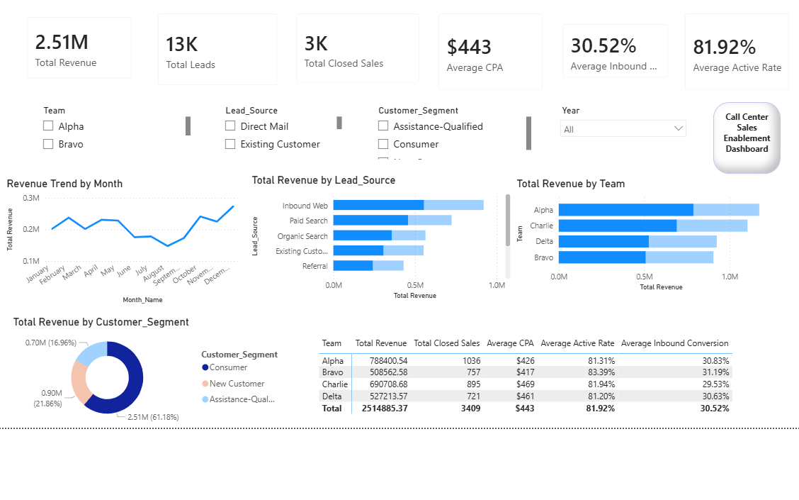

# Call Center Sales Enablement Analytics Dashboard
## Dashboard Preview

## Skills Demonstrated

- Power BI Dashboard Development
- Data Modeling (Star Schema)
- DAX Measures
- KPI Reporting
- Interactive Slicers and Filtering
- Data Visualization
- Business Intelligence Analytics
- Sales Performance Analysis
## Overview

This project demonstrates how business intelligence tools can transform operational sales data into actionable insights. The dashboard analyzes customer acquisition, conversion performance, agent productivity, operational efficiency, revenue generation, and retention metrics through an interactive Power BI reporting solution.

The project uses a synthetic dataset designed to simulate a modern contact center sales environment while protecting privacy and confidentiality.

---

## Business Problem

Organizations often collect large volumes of sales, customer, and operational data but struggle to convert that information into meaningful insights.

Leadership teams require visibility into:

* Customer acquisition costs
* Conversion performance
* Workforce productivity
* Revenue generation
* Retention metrics
* Operational efficiency

Without centralized reporting, decision makers may miss opportunities to improve performance and profitability.

---

## Solution

This Power BI dashboard provides:

* Executive KPI monitoring
* Sales performance analytics
* Lead source effectiveness tracking
* Operational efficiency reporting
* Customer retention analysis
* Revenue performance insights

The solution is built using a dimensional star schema model to support scalable reporting and interactive filtering.

---

## Technologies Used

* Power BI
* Power Query
* DAX
* Excel
* Dimensional Modeling
* Star Schema Design
* Business Intelligence
* Data Analytics

---

## Data Model

The project utilizes a star schema architecture consisting of:

### Fact Table

* Fact_Sales_Performance

### Dimension Tables

* Dim_Date
* Dim_Agent
* Dim_Team
* Dim_Lead_Source
* Dim_Product
* Dim_Customer_Segment
* Dim_Status

---

## Key Performance Indicators

### Acquisition Metrics

* Cost Per Acquisition (CPA)
* Lead Volume
* Lead Source Performance

### Conversion Metrics

* Inbound Conversion Rate
* Outbound Conversion Rate
* Appointment Show Rate

### Productivity Metrics

* Sales Per Hour
* Average Handle Time (AHT)
* Active Rate
* After Call Work (ACW) Rate

### Revenue Metrics

* Revenue
* Revenue Per Sale
* Cross-Sell Rate

### Retention Metrics

* Activation Rate
* Retention Rate

---

## Dashboard Pages

### Executive Overview

Provides leadership visibility into overall business performance.

### Sales Performance Analytics

Analyzes agent productivity, conversion rates, and sales outcomes.

### Lead Source Analytics

Evaluates acquisition channels and cost efficiency.

### Operational Efficiency

Monitors workforce productivity and contact center performance.

### Customer Retention & Revenue Quality

Tracks customer retention, activation, and revenue outcomes.

---

## Data Privacy

This project uses fully synthetic data created exclusively for educational and portfolio purposes.

No real customer information, employee information, company data, or proprietary information is included.

---

## Future Enhancements

* Predictive Analytics
* Sales Forecasting
* AI-Powered Performance Insights
* Executive Mobile Reporting
* Automated KPI Alerts

---

## Author

Dwayne A. Mickens

Performance Improvement Manager | Business Intelligence | Data Analytics | Cloud Computing
